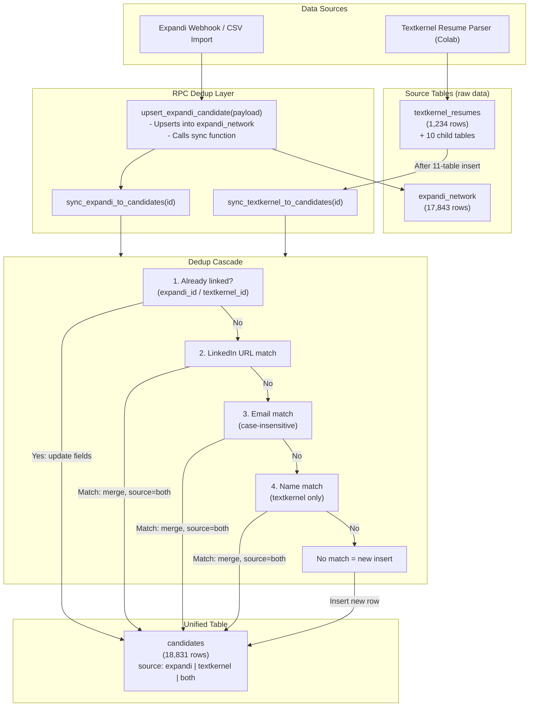

# Candidate Sync & Deduplication Flow

## Architecture Overview



## Dedup Cascade by Source

### Expandi Contacts

```
1. expandi_id    -- already linked? update fields only
2. linkedin_url  -- strongest external identifier
3. email         -- very stable, case-insensitive
   (name match excluded -- historical false positives)
```

### Textkernel Resumes

```
1. textkernel_id -- already linked? update fields only
2. email         -- from textkernel_emails table
3. first + last  -- fallback, both must be non-null
```

## Merge Strategy

When a match is found, fields merge using COALESCE (keep existing, fill blanks):

```
Expandi-owned fields:     linkedin_url, contact_status, conversation_status,
                          concat_tags, connected_at, invited_at

Textkernel-owned fields:  professional_summary, highest_degree, skills_summary,
                          management_score, months_work_experience, cv_file_name

Shared fields:            first_name, last_name, email, phone,
                          current_title, current_company, location
                          (first non-null value wins)
```

## How to Call

```sql
-- Expandi: full pipeline (upsert source + sync to candidates)
SELECT upsert_expandi_candidate('{"id": 12345, "first_name": "John", ...}'::jsonb);

-- Textkernel: after your Colab script inserts into textkernel_* tables
SELECT sync_textkernel_to_candidates('resume-uuid-here'::uuid);

-- Re-sync an existing expandi contact
SELECT sync_expandi_to_candidates(12345);
```

## Current Stats (2026-02-13)

| Source | Count |
|---|---|
| expandi only | 17,602 |
| textkernel only | 989 |
| both (merged) | 240 |
| **total candidates** | **18,831** |

## Known Limitation

One candidate can only link to one textkernel resume (`textkernel_id` is unique).
If the same person has two resume files, the first one gets linked.
The second resume still enriches/updates the candidate's fields,
but its `textkernel_id` is not stored on the candidate row.
